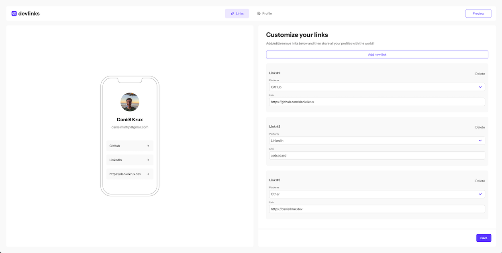

# devlinks

devlinks is a platform where you can create a page that contains your most important developer links, like GitHub, LinkedIn etc,... You can manage your links and public profile data on the dashboard.

## Demo

You can create an account and share your links at [https://link-share-danielkrux.vercel.app/login](https://link-share-danielkrux.vercel.app/login).

## Tech talk

The web app is made with [NextJS](https://nextjs.org/docs)'s new app router approach. Most of the components are Server Components. The backend used for this project is Supabase.

The styling is done with [TailwindCSS](https://tailwindcss.com/docs).
